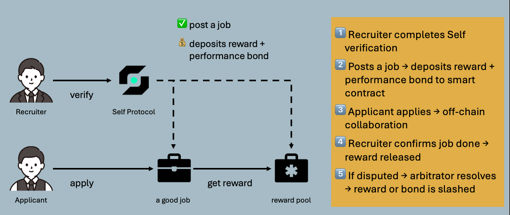
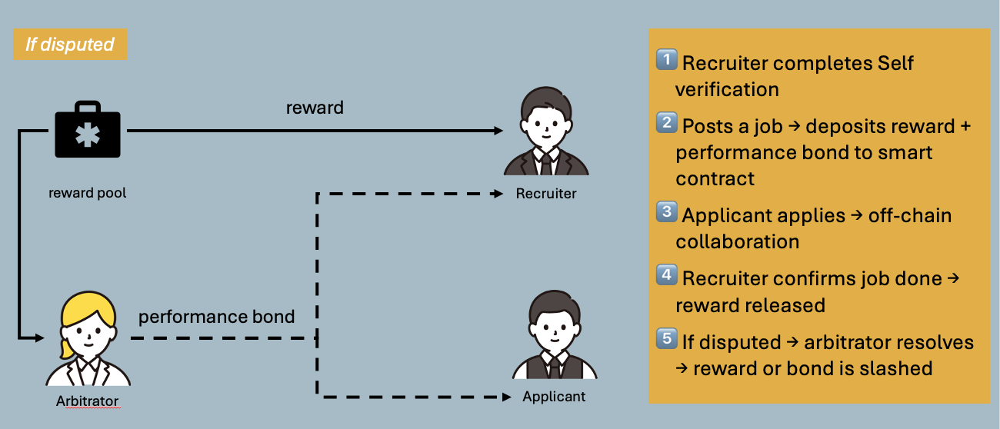

# Self-Verified Job Platform

## 🔗 Quick Links

- [Demo Page](https://trusted-jobs-ui.vercel.app/)
- [Platform Workflow](#-platform-workflow)
- [Framework](#-framework)
- [Smart Contract Logic](#-smart-contract-logic-jobescrowsol)
- [Development](#-development)
- [Self Protocol Verification](#-self-protocol-verification)

A decentralized job platform that protects job seekers by enforcing recruiter identity verification (via Self Protocol) and locking rewards into a smart contract escrow. Only when the job is completed and confirmed, the reward and performance bond will be released. If a dispute arises, an arbitrator may decide the fund's final direction.

### 🛠 Platform Workflow

#### 📌 Normal Flow

#### ⚠️ Dispute Flow

### 🧱 Framework

👾 Gameplay / Workflow

1. Recruiter connects wallet & completes Self Protocol verification (Name, Nationality, Age, Sanction Check).

2. Recruiter posts a job and deposits reward + performance bond into a smart contract.

3. Applicants browse jobs and apply (off-chain collaboration and communication).

4. When the work is complete, the recruiter confirms — the funds (reward + deposit) go to the applicant.

5. If a dispute occurs, an arbitrator can slash the bond or refund all to recruiter based on the situation.

### 🎯 Smart Contract Logic (JobEscrow.sol)

[Celo Mainnet](https://celo.blockscout.com/address/0x0E6be64199930b1aa1AF03C89ed7245A97d1f1Ad?tab=contract)

[Celo Alfajores Testnet](https://celo-alfajores.blockscout.com/address/0xBF7F45091686b4d5c4f9184D1Fa30A6731a49036?tab=contract)

Recruiter must deposit both reward and a 10% performance bond when posting a job.

Funds are locked until one of the following occurs:

- withdrawToApplicant(jobId) → Recruiter approves; all funds sent to applicant.

- slashToApplicant(jobId) → Arbitrator resolves in applicant's favor; bond sent.

- slashToRecruiter(jobId) → Arbitrator resolves in recruiter's favor; all funds refunded.

- refundToRecruiter(jobId) → Recruiter cancels job before assignment; full refund.

### 🧪 Development

This contract is deployed on the Celo Alfajores testnet (for testing). You can deploy and test using Remix with the following configuration:

#### 🛠 Remix Setup

- Environment: Injected Provider (MetaMask)

- Network: Celo Alfajores

- Contract Name: JobEscrow.sol

- Compiler Version: 0.8.17

- Deployed Address: 0xYourContractAddress

✅ Celo Faucet (Alfajores)

[Get test tokens](https://celo.org/developers/faucet)

### 🔐 Self Protocol Verification

This project uses Self.ID Protocol to verify recruiters:

1. Recruiters must prove their identity with ZK Proofs of:

- Full Name

- Nationality

- Age

- Sanctions Check (Not listed)

2. Once verified, they receive a “✅ Verified” badge and unlock access to:

- Job Posting

- Funds Deposit Interface

### 💡 Future Improvements

- On-chain job application mechanism

- Decentralized arbitration DAO

- Reputation scoring using on-chain history

#### Made by Jon Wang & Ben Shen
